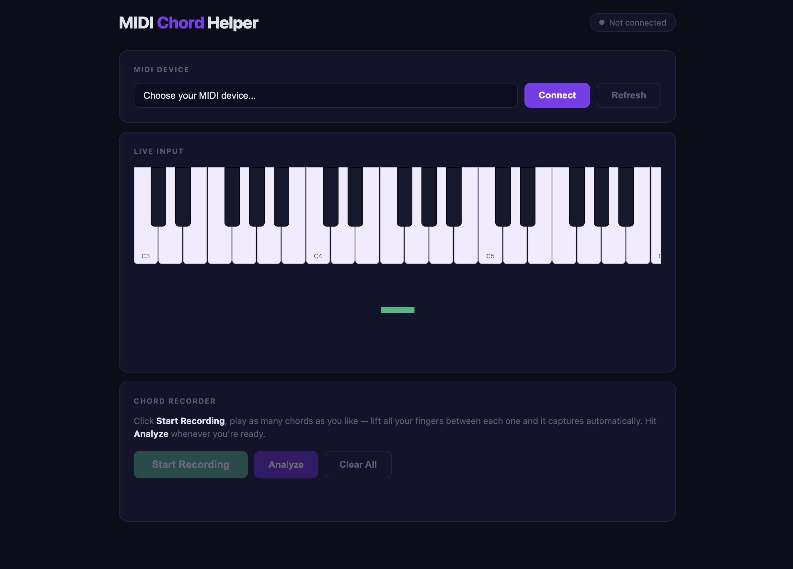

# MIDI Chord Helper

A local web app that listens to your MIDI piano in real time, identifies the chords you're playing, and suggests notes, scales, and chords that work well with your progression.



## What it does

- Lights up a piano keyboard on screen as you play
- Detects and names chords in real time (major, minor, 7ths, sus, add9, and more)
- **Auto-capture mode** — just play and lift your hands between chords, no button pressing needed
- Record as many chords as you like (3, 5, 10 — whatever your progression is)
- Hit **Analyze** at any time to get:
  - The detected key (major or minor)
  - All the scale notes
  - Every diatonic chord that fits
  - A few extra "color chords" with explanations

## Requirements

- A Mac (Python 3 comes pre-installed — nothing to install)
- A MIDI piano connected via Bluetooth or USB

## Setup (first time only)

**Step 1 — Download the app**

Click the green **Code** button on this page → **Download ZIP**, then unzip it.

**Step 2 — Run it**

Open **Terminal** (press `Cmd + Space`, type Terminal, hit Enter), then drag the unzipped folder into the Terminal window and press Enter. Then type:

```bash
bash run.sh
```

The first run installs a few small Python packages automatically — this takes about 30 seconds and only happens once.

**Step 3 — Open in browser**

Go to **http://localhost:5001**

That's it. Every time after this, just open Terminal, go to the folder, and run `bash run.sh`.

## How to use

1. Make sure your MIDI piano is connected before opening the browser
2. Select your piano from the dropdown and click **Connect**
3. Click **Start Recording**
4. Play a chord with both hands, then lift all your fingers — it captures automatically
5. Repeat for as many chords as you want
6. Click **Analyze** to see what key you're in and what chords/notes fit

## Tech

- Python + Flask + Flask-SocketIO (backend, MIDI handling, music theory)
- Plain HTML/CSS/JS with Socket.IO (frontend)
- [mido](https://mido.readthedocs.io/) for reading MIDI input via CoreMIDI
